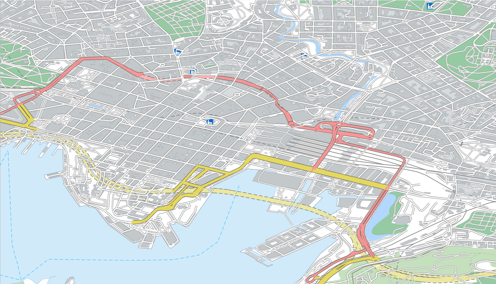
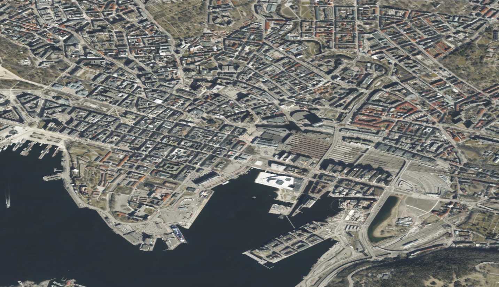

# Norkart API Bakgrunnskart Documentation

Welcome to the documentation for Norkart API Bakgrunnskart. This service collects the most commonly used background maps needed to create a map service. This service provides access to background maps using both Tile Map Service (TMS) and Web Map Service (WMS). Below are the available map layers in this API:


| Tjenestenavn  | Type | Description | url |
| ------------- | ------------- | ------------- | ------------- |
| **Maptiles**  | TMS | Base map using tile service| https://waapi.webatlas.no/maptiles/{tileset}/{z}/{x}/{y}.jpeg?APITOKEN={{API_KEY}}|
| **WMS-STANDARKART** | WMS | Base map using Web map service| https://waapi.webatlas.no/WMS-STANDARDKART/?APITOKEN={{API_KEY}}|
| **WMS-VEKTOR-GRAY**  | WMS | Grey tone base map | https://waapi.webatlas.no/WMS-VEKTOR-GRAY/?APITOKEN={{API_KEY}}|
| **WMS-Orto**  | WMS | Satellitte image base map (ortographic map) | https://waapi.webatlas.no/wms-orto/?APITOKEN={{API_KEY}}|

<br/>

| <p align="center">Standard</p> | <p align="center">Grey scale</p> | <p align="center">Ortophoto</p> |
| ------------- | ------------- | ------------- |
| | | |

## Available maps (Tilesets) for TMS

Several types of map are available through the TMS service by replacing the "tileset" parameter in the url. The available maps are listed bellow:

```javascript
options: {
    url: '//waapi.webatlas.no/maptiles/tiles/{tileset}/wa_grid/{z}/{x}/{y}.{ext}?APITOKEN={apikey}',
    tileset: {
        vector: {tileset: 'webatlas-standard-vektor', ext: 'png'},
        aerial: {tileset: 'webatlas-orto-newup', ext: 'jpeg'},
        hybrid: {tileset: 'webatlas-standard-hybrid', ext: 'jpeg'},
        grey: {tileset: 'webatlas-gray-vektor', ext: 'png'},
        medium: {tileset: 'webatlas-medium-vektor', ext: 'png'},
        lite: {tileset: 'webatlas-lite-vektor', ext: 'png'}
    },
}
```

## Authentication / API Key

To use Norkart's map services, you will need an API key. API keys are provided on a business-to-business (B2B) basis. If you are interested in a demo or wish to request an API key, please contact us at [datatjenester@norkart.no](mailto:datatjenester@norkart.no).

Once you have an API key, include it in your requests as a URL parameter. For example:

```bash
https://waapi.webatlas.no/maptiles/{tileset}/{z}/{x}/{y}.jpeg?APITOKEN={{API_KEY}}
````
Replace {{API_KEY}} with your actual API key.

### Introducing TMS and WMS
#### What is Tile Map Service (TMS)?
Tile Map Service (TMS) is a standard protocol for serving maps as small image tiles. Norkart's TMS offers high-performance delivery of map tiles in XYZ format. This is ideal for rendering fast, responsive maps on web or mobile applications. You can integrate TMS into various platforms, including web frameworks like Leaflet, OpenLayers, and Mapbox, as well as desktop GIS applications.For detailed information on how to use TMS in your applications, see the [TMS subsection](../Articles/TMS/README.md).

#### What is Web Map Service (WMS)?
Web Map Service (WMS) is a standard protocol for requesting map images dynamically from a server. Norkart’s WMS allows users to retrieve map images in various formats (such as JPEG, PNG) and customize the rendering by specifying parameters like bounding box, zoom level, and layers. WMS is highly flexible and can be integrated into web mapping frameworks or desktop GIS systems such as QGIS and ArcGIS. For more on how to use WMS services, see the [WMS subsection](../Articles/WMS/README.md).

##### Integration Guides #####
We provide detailed guides on how to integrate our services into various systems such as QGIS, Leaflet.js, and other GIS software.


For additional help or support regarding API access or integration, reach out to [datatjenester@norkart.no](mailto:datatjenester@norkart.no).