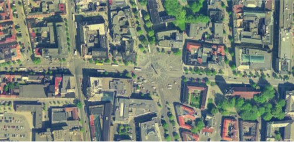
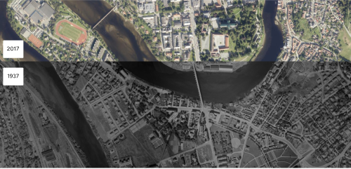

# API Flyfotokart Historisk

Historiske flyfoto over hele Norge

API Flyfotokart Historisk er en kart- og flyfototjeneste som gir tilgang til historiske flyfoto over hele Norge. Tjenesten gir tilgang til verdifulle historiske flyfoto som gir muligheten til å utforske Norges landskap slik det har utviklet seg over tid.

Tjenesten tilbyr et omfattende arkiv av detaljerte historiske kart og flyfoto, inkludert eldre prosjekter. Den oppdateres kontinuerlig med nye historiske ortofotoprosjekter. Sorteringsmetodene sikrer prioritert visning basert på oppløsning og fotodato.

## Bruksområder

Her er noen eksempler på mulig bruk av de forskjellige bakgrunnskartene i tjenester. Alle kartene er lette å integrere i eksisterende webapplikasjoner.

- **Hvordan så byen ut for 20 år siden?**
  - Ved å bruke tjenesten kan man finne historiske bilder fra spesifikke år og se hvordan forskjellige byer og områder så ut akkurat da. For eksempel kan man se biltrafikk på Trondheim Torg i tidligere tider.
- **Hvordan har byen forandret seg?**
  - Ved å sammenlikne forskjellige historiske flyfoto kan man finne ut hvordan byen har forandret seg, hvordan veier er lagt om, når bygninger ble bygget og mer. Dette kan brukes til markedsføring, historisk forskning og museumsutstillinger.

## Eksempler på historiske flyfoto
Her er to eksempler på historiske flyfoto fra tjenesten:

1. Trondheim Torg på 1960-tallet - Dette flyfotoet viser hvordan Trondheim Torg så ut med aktiv biltrafikk gjennom torget. I dag er området bilfritt og en viktig møteplass i byen.



1. Byutvikling over tid - Dette bildet viser samme område fotografert med flere års mellomrom. Man kan tydelig se hvordan bebyggelse, veier og grøntområder har endret seg gjennom årene.





## Tjeneste-URL

```
https://waapi.webatlas.no/wms-orto-hist/
```

## WMS-operasjoner

|                                  |                                                                                                                         |
|----------------------------------|-------------------------------------------------------------------------------------------------------------------------|
| **GetCapabilities**              | Henter metadata om tjenesten, inkludert tilgjengelige lag og parametre                                                  |
| **GetMap**                       | Henter et kartbilde for et spesifisert område og innhold                                                                |
| **GetLegendGraphic (valgfritt)** | Henter en generert tegnforklaring for et kartlag                                                                        |

## Eksempel på GetCapabilities-request

```
GET https://waapi.webatlas.no/wms-orto-hist/?REQUEST=GetCapabilities&SERVICE=WMS&api_key={{API_KEY}}
```

## Eksempel på GetMap-request

```
https://waapi.webatlas.no/wms-orto-hist/?SERVICE=WMS&REQUEST=GetMap&VERSION=1.1.1&LAYERS=wms-orto-hist:historisk&FORMAT=image/png&TRANSPARENT=true&HEIGHT=256&WIDTH=256&SRS=EPSG:3857&BBOX=640007.2378317807,8171118.323685342,640083.6748600659,8171194.760713628&api_key={{API_KEY}}
```

## Bruk i QGIS

For å bruke WMS i QGIS, lim inn URL med din Norkart API-nøkkel på slutten av URL-en. Husk å huke av for "Ignore GetMap/GetTile/GetLegendGraphic".


## Bruk i Leaflet.js

```javascript
var map = L.map('map').setView([63.43, 10.39], 13);
L.tileLayer.wms("https://waapi.webatlas.no/wms-orto-hist/", {
    layers: 'wms-orto-hist:historisk',
    format: 'image/png',
    transparent: true,
    attribution: '&copy; Norkart',
    api_key: '{{API_KEY}}'
}).addTo(map);
```

## Bruk i Mapbox GL JS

```javascript
map.addSource('wms', {
  'type': 'raster',
  'tiles': [
    'https://waapi.webatlas.no/wms-orto-hist/?SERVICE=WMS&REQUEST=GetMap&VERSION=1.1.1&LAYERS=wms-orto-hist:historisk&FORMAT=image/png&TRANSPARENT=true&BBOX={bbox-epsg-3857}&SRS=EPSG:3857&WIDTH=256&HEIGHT=256&api_key={{API_KEY}}'
  ],
  'tileSize': 256
});
map.addLayer({
  'id': 'wms-layer',
  'type': 'raster',
  'source': 'wms',
  'paint': {}
});
```

## Bruk i OpenLayers

```javascript
var wmsSource = new ol.source.TileWMS({
  url: 'https://waapi.webatlas.no/wms-orto-hist/',
  params: {'LAYERS': 'wms-orto-hist:historisk', 'TILED': true, 'api_key': '{{API_KEY}}'},
  serverType: 'geoserver'
});
var wmsLayer = new ol.layer.Tile({
  source: wmsSource
});
var map = new ol.Map({
  target: 'map',
  layers: [wmsLayer],
  view: new ol.View({
    center: ol.proj.fromLonLat([10.39, 63.43]),
    zoom: 13
  })
});
```

## Ressurser
- [WMS i Leaflet](https://leafletjs.com/examples/wms/wms.html)
- [WMS i Mapbox](https://docs.mapbox.com/mapbox-gl-js/example/wms/)
- [Geoserver WMS-dokumentasjon](https://docs.geoserver.org/stable/en/user/services/wms/reference.html)

## Kontakt og tilgang
For kontakt og tilgang til API-nøkkel, se [Norkart Datatjenester](https://www.norkart.no/datatjenester). 