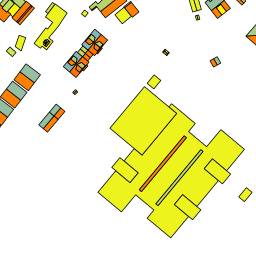
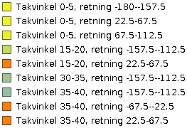
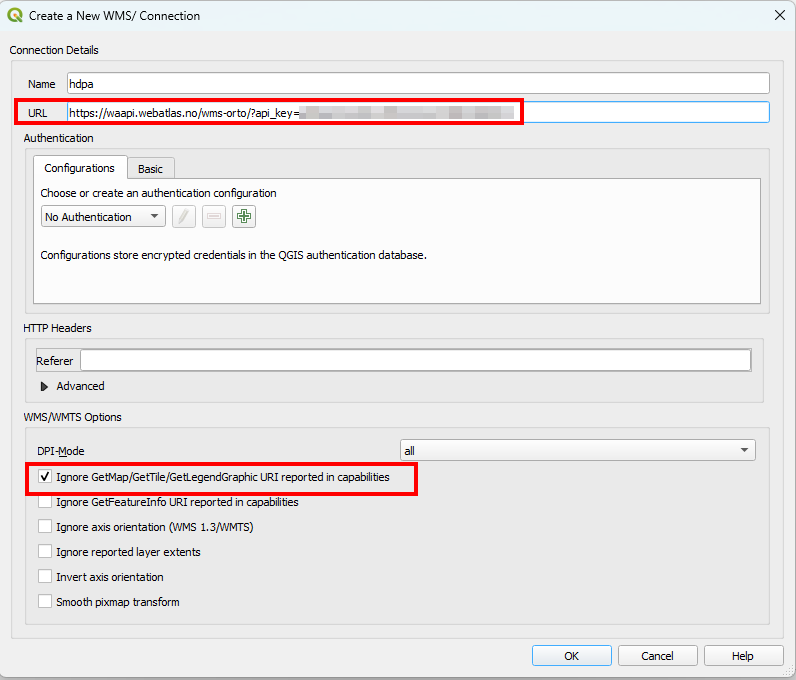
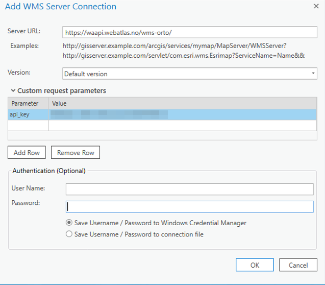

# Web-Map-Services-(WMS) dokumentation

WMS provides a standardised way of showing raster map layers on a map over http. It can be used on websites through services such as leaflet and mapbox or can be used in desktop GIS software such as QGIS or ArcGIS.

Norkart provides a range of WMS services such as thematic data, background maps, aerial images and historical maps.

## Operations:

WMS requests can perform (among others) the following operations [[1]](#1):

|                                  |                                                                                                                         |
|----------------------------------|-------------------------------------------------------------------------------------------------------------------------|
| **GetCapabilities**              | Retrieves metadata about the service, including supported operations and parameters, and a list of the available layers |
| **GetMap**                       | Retrieves a map image for a specified area and content                                                                  |
| **GetLegendGraphic (optional)** | Retrieves a generated legend for a map                                                                                  |

## Example calls
Examples are shown for wms-takhelning. If you want to test this out yourself you will need an Api key. Test the examples by replacing '{{API_KEY}}' with your own api key. Request API access [here](https://www.norkart.no/dataoganalyse/).

## GetCapabilities:

### Request:

```
GET https://waapi.webatlas.no/WMS-Takhelning/?REQUEST=GetCapabilities&SERVICE=WMS&api_key={{API_KEY}}
```

### Result:
- A xml with metadata about the service, including supported operations and parameters, and a list of the available layers (too large to show)


## GetMap:

### Request:

```
https://waapi.webatlas.no/wms-takhelning/?SERVICE=WMS&REQUEST=GetMap&VERSION=1.1.1&LAYERS=wms-takhelning:takhelning&FORMAT=image/png&TRANSPARENT=true&HEIGHT=256&WIDTH=256&SRS=EPSG:3857&BBOX=640007.2378317807,8171118.323685342,640083.6748600659,8171194.760713628&api_key={{API_KEY}}
```

### Result:




## GetLegendGraphic:

In this example, we limit the results to the matching features that occur withing the provided bounding box. See more details in geoservers docs about legend graphics [[2]](#2)

### Request:

```
https://waapi.webatlas.no/wms-takhelning/?REQUEST=GetLegendGraphic&VERSION=1.0.0&FORMAT=image/png&WIDTH=20&legend_options=hideEmptyRules:true&LAYER=wms-takhelning:takhelning&SRS=EPSG:3857&BBOX=640007.2378317807,8171118.323685342,640083.6748600659,8171194.760713628&api_key={{API_KEY}}

```

### Result:



## Use Norkart WMS in QGIS or ArcGIS


### QGIS ###
To use WMS in QGIS, past the url with your Norkart API key at the end of the url. Make sure to tick the Ignore GetMap/GetTile/GetLegendeGraphic checkbox.



>[!IMPORTANT]
> Remember to check the Ignore GetMap/GetTile/GetLegendeGraphic checkbox. The map will not be displayed unless this option is ticked!

### ArcGIS


> 
> [!TIP]
> ### Other desktop viewers
> Gemini and other software have issues adding the &api_key to the URL, so you might want to try to reverse the order. So instead of:
> You can try
>
>```
>GET https://waapi.webatlas.no/WMS-Takhelning/?api_key={{API_KEY}}&REQUEST=GetCapabilities&SERVICE=WMS
>```

### Additional Application Examples
Here are a few more examples of how you can use Norkart WMS in different scenarios:

**Using WMS in Leaflet.js**
````javascript
var map = L.map('map').setView([63.43, 10.39], 13);

L.tileLayer.wms("https://waapi.webatlas.no/wms-takhelning/", {
    layers: 'wms-takhelning:takhelning',
    format: 'image/png',
    transparent: true,
    attribution: '&copy; Norkart',
    api_key: '{{API_KEY}}'
}).addTo(map);

Using WMS in Mapbox GL JS

map.addSource('wms', {
  'type': 'raster',
  'tiles': [
    'https://waapi.webatlas.no/wms-takhelning/?SERVICE=WMS&REQUEST=GetMap&VERSION=1.1.1&LAYERS=wms-takhelning:takhelning&FORMAT=image/png&TRANSPARENT=true&BBOX={bbox-epsg-3857}&SRS=EPSG:3857&WIDTH=256&HEIGHT=256&api_key={{API_KEY}}'
  ],
  'tileSize': 256
});

map.addLayer({
  'id': 'wms-layer',
  'type': 'raster',
  'source': 'wms',
  'paint': {}
});
````
**Using WMS in OpenLayers**
````javascript
var wmsSource = new ol.source.TileWMS({
  url: 'https://waapi.webatlas.no/wms-takhelning/',
  params: {'LAYERS': 'wms-takhelning:takhelning', 'TILED': true, 'api_key': '{{API_KEY}}'},
  serverType: 'geoserver'
});

var wmsLayer = new ol.layer.Tile({
  source: wmsSource
});

var map = new ol.Map({
  target: 'map',
  layers: [wmsLayer],
  view: new ol.View({
    center: ol.proj.fromLonLat([10.39, 63.43]),
    zoom: 13
  })
});
````

## Useful resources:
- Wms in leaflet: https://leafletjs.com/examples/wms/wms.html
- Wms in mapbox: https://docs.mapbox.com/mapbox-gl-js/example/wms/
- Geoserver wms-documentation: https://docs.geoserver.org/stable/en/user/services/wms/reference.html

## References
<a id="1">[1]</a> 
Geoserver. 
WMS reference. 
https://docs.geoserver.org/stable/en/user/services/wms/reference.html.

<a id="2">[2]</a> 
Geoserver. 
GetLegendGraphic. 
https://docs.geoserver.org/latest/en/user/services/wms/get_legend_graphic/index.html#colormap-type-is-ramp


