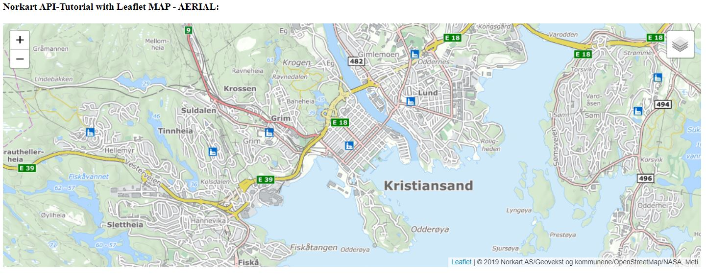
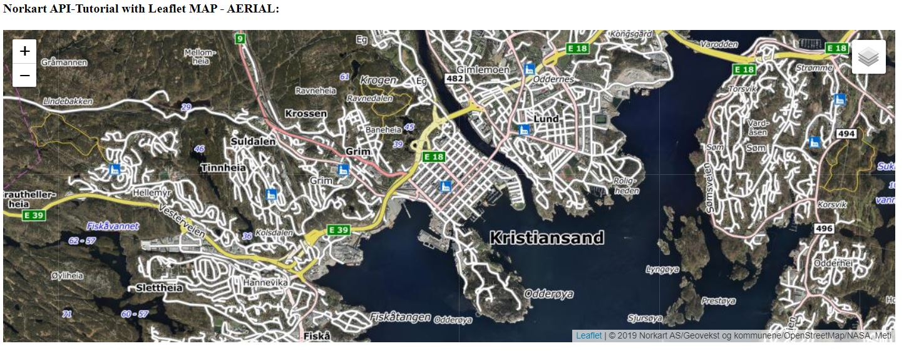
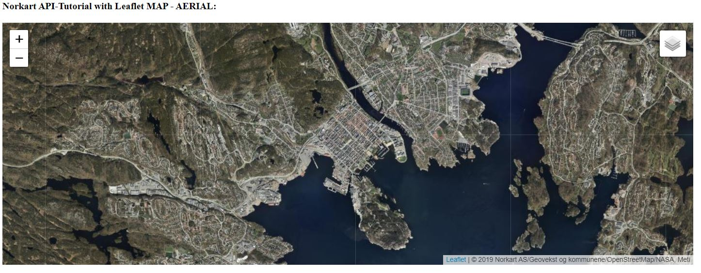

# Getting started with maptiles in Leaflet.js

[Developer documentation for Maptiles](../API-maptiles)


Relevant code-examples

* [CodePen example of Maptiles in Leaflet.js](https://codepen.io/alexanno/pen/EzrjEb)
* [Code for the tutorial below](./Kart-Flyfoto)


# Step by step guide

## Table of Contents

1. [Maps and AERIAL View in Leaflet Description](#1-maps-and-aerial-view-in-leaflet-description)
2. [HTML setup](#2-html-setup)
3. [Cascading Style Sheets (CSS) setup](#3-cascading-style-sheets-css-setup)
4. [Javascript setup](#4-javascript-setup)
5. [Code Example](#5-code-example)
6. [Maps and AERIAL View](#6-maps-and-aerial-view)
7. [Summary](#7-summary)

## 1. Maps and AERIAL View in Leaflet Description

[**Leaflet**](https://leafletjs.com/) is one of the leading open source javaScript library that is widely used for making interactive maps. It offers all the mapping features that are needed and fulfills most developers's need.
In this tutuorial, we have used leaflet map that extends AERIAL view mapping for Norkart users. It is relative easy and convenient for everyone who wants in-depth zooming based on defined coordinates.
_The leaflet map - AERIAL_ view tutorial will give insight and let you set the view to coordinates for example **(in WGS84 / EPSG:3857)**, also set the zoom level as per the requirement. The tutorial is made to guide step by step with spliting up the code into different parts where the user can get an overview of how each part works in leaflet map - AERIAL.

## 2. HTML Setup

#### STEP 2.1: Declare your application HTML5.

Firstly, we will declare the file as a HTML5 document. 

```
<!DOCTYPE html>
<html>

<head>
<meta charset="utf-8" />

<title>Norkart API-Tutorial with Leaflet MAP - AERIAL</title>
```

#### STEP 2.2: Include Leaflet CSS file in the head section of your document.

To enable the usage for Leaflet (interactive map), we need to include the CSS-file in the header of the HTML file we are working on.

```
<link rel="stylesheet" href="https://unpkg.com/leaflet@1.5.1/dist/leaflet.css"
   integrity="sha512-xwE/Az9zrjBIphAcBb3F6JVqxf46+CDLwfLMHloNu6KEQCAWi6HcDUbeOfBIptF7tcCzusKFjFw2yuvEpDL9wQ=="
   crossorigin=""/>
```

Then we have another CSS-file that will also include in the header because this will enable us to define the map style that how it will look like. 

```
<link rel="stylesheet" href="mFlyfoto.css"/>
```

#### STEP 2.3:  Include Leaflet JavaScript file after Leaflet’s CSS:

We will include JavaScript file that includes all the Leaflet functions in the header.

```
<script src="https://unpkg.com/leaflet@1.5.1/dist/leaflet.js"
   integrity="sha512-GffPMF3RvMeYyc1LWMHtK8EbPv0iNZ8/oTtHPx9/cc2ILxQ+u905qIwdpULaqDkyBKgOaB57QTMg7ztg8Jm2Og=="
   crossorigin=""></script>
```

After this we will end the header section of the HTML-file.

```
</head>
```

#### STEP 2.4: Defining the body.

Through defining the body, the content will be shown in the browser as we would like to present as a result.

```
<body>
Norkart API-Tutorial with Leaflet MAP - AERIAL:

  <!-- This is the container for the map-->
  <div id="mapid"></div>
```

Then we will include JavaScript files to enable the usage of the map.

```
  <!-- Load Norkart's Leaflet plugin for Maptiles: L.TileLayer.Webatlas
  Use the latest version at: https://github.com/Norkart/L.TileLayer.Webatlas -->
  <script src="https://cdn.jsdelivr.net/gh/norkart/L.TileLayer.Webatlas/L.TileLayer.Webatlas.min.js"></script>
  <script type="text/javascript" src="mFlyfoto.js"></script>

</body>

</html>
```


## 3. Cascading Style Sheets (CSS) setup

The CSS file which is created, will be used to define the layout of the map. We can modifty the height and the width of the map as per different needs.

```
#mapid {
  width: 100%;
  height: 640px;
}
```

## 4. Javascript Setup

As mentioned above, the JavaScript file is a backbone of two other files such as HTML, CSS that works as backend.
To create the JavaScript file, one must define a text file with **.js** extension as **save as** option.

#### 4.1 Initiate Leaflet map and set the starting view to chosen cordinates:

We will now start working on the JavaScript-file.
In the begnning, we initiate Leaflet map and set the view to coordinates (in WGS84 / EPSG:3857) and zoom level 13 through variable as shown below.

```
var map = L.map('mapid').setView([58.14615, 7.99573], 13);
```

#### 4.2 Initiate and define variable with API key.

We then define a variable and instantiate with API key. (As shown below)

```
var apiKey = '07C4A129-9D26-4B3D-9BC8-B22E4B6E509E'; //DO NOT USE THIS KEY: DEMO ONLY
```

#### 4.3 Define different type of views on map displaying.

The below code illustrates how one can add up different _type of Views_. As we have declared a variable called **baselayers** as kind of list elements in it.
There are different attributes or objects are used which are:

- L.TileLayer
  It is used to load and display _tileLayer_ object on the map.
- L.tileLayer.webatlas
  **Webatles** is a custom defined method by Norkart that is being called here.
- mapType
  As name defined itself which means what kind of map are we going to use, here (type is _Vector_).
- apikey: apiKey
  }).addTo(map)
  Here at first line, **apikey** is being called and setting the collection in **apiKey** (one can see the difference between them). In the last line, the element is adding up to map which is selected.
  The complete section of this code is shown below.

```
var baseLayers = {
    'Kart': L.tileLayer.webatlas({
        mapType: L.TileLayer.Webatlas.Type.VECTOR,
        apikey: apiKey
    }).addTo(map),
```

#### 4.4 The whole code section ready to display different views

We have set different views under the part of defining different views displaying on the map by having a drop down list. Below is the complete code.

```
var baseLayers = {
    'Kart': L.tileLayer.webatlas({
        mapType: L.TileLayer.Webatlas.Type.VECTOR,
        apikey: apiKey
    }).addTo(map),
    'Foto': L.tileLayer.webatlas({
        mapType: L.TileLayer.Webatlas.Type.AERIAL,
        apikey: apiKey
    }),
    'Hybrid': L.tileLayer.webatlas({
        mapType: L.TileLayer.Webatlas.Type.HYBRID,
        apikey: apiKey
    })
};

L.control.layers(baseLayers, {}).addTo(map);

```

In the last line of the above code, **L.control.layers(baseLayers, {}).addTo(map)** that calls Leaflet control object where _layers_ is having baselayers collection and adding up to the map.

## 5. Code Example

The code example is based on three different parts as discussed above (HTML, CSS and JavaScript). The purpose of this code example is to give an overview to the user and can take a look how it has written and work using _Leaflet_ library.

Find the complete code example at the folder [Kart-Flyfoto](./Kart-Flyfoto)

## 6. Maps and AERIAL View

Under this heading, the user will find screenshots of different _AERIAL VIEWS_ such as **Normal mode, Hybrid and Foto mode**. The code example has limited _AERIAL VIEWS_ but it can be extended if the user needs other than these modes _(**NB** have attached other modes as comment field in the code example)_.

## 6.2 Screeshots

We have attached some images taken in different _Webatlas_ types.

#### 6.2.1. Normal mode



#### 6.2.2. Hybrid mode



#### 6.2.3. Foto mode



## 7. Summary

In this tutorial, one can get a basic step by step guide regarding _API-Tutorial with Leaflet MAP - AERIAL_. This tutorial also gives an overview of _Leaflet_ Javascript library that has used while writing the code. The code example is explained in small chunks, so that the user could understand the basic use of _Leaflet Map_, different objects and methods related to this library. In the end, there are some screenshots with different _AERIAL Views_ that can be useful in different scenarios. 