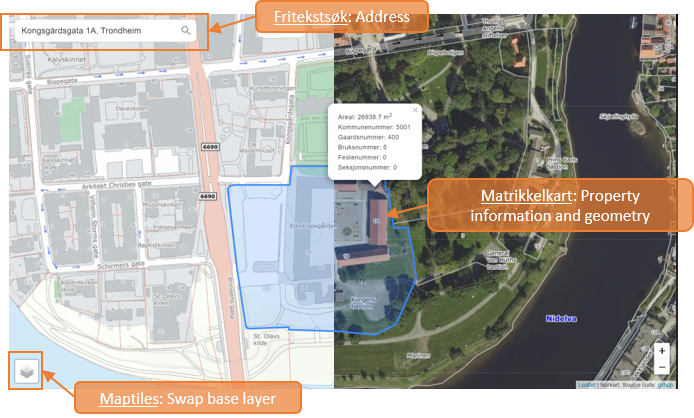

# Maptiles, Fritekstsøk and Matrikkelkart API Demo

Go to the [Live demo](https://mango-flower-0fd4d4b03.azurestaticapps.net/).

This is a demo of Norkart's maptiles, search and 'matrikkelkart' APIs. In this simple app, you can:
- Search for an address in Norway and see the geometry for your selected property.
- Click on the geometry to see more information about the property.
- Change between norkart's various maptiles. 

## API Key
In order to see the demo or use these APIs in your own projects, you will first need an API key. Norkart provides a free trial API key, which you can get by logging in with your github account at [developer.norkart.no](https://developer.norkart.no/).

## Built With
- Typescript - Language.
- [React](https://reactjs.org//) - Front end library.
- [Recoil](https://recoiljs.org/) - For state management.
- [Leaflet](https://leafletjs.com/) - For rendering the interactive map.
- [React Leaflet](https://react-leaflet.js.org/) - For integrating leaflet with react.
- [Material-UI](https://material-ui.com/) - For design system and components.

## Run Locally
This is a react app. To run it locally you will need to use npm or yarn to install packages and run the app.

## About the code
### Maptiles
In the demo, you can view the different map tile layers that Norkart serves by using the layer control in the bottom left corner. see the file called ` BaseLayerControl.tsx` to see how this is implemented.

### Address Search
Norkart fritekstsøk is used to look up addresses in Norway. Check out `fritekstsokapi.ts` to see the expected return type how you can query the api from javascript.

### Matrikkelkart
Norkart matrikkelkart is used in this demo to query the geometry (teig) for the selected address. See `matrikkelkartapi.ts` for the expected return type how you can query the api from javascript.

## Relevant Documentation and Links
- [Maptiles Documentation](https://github.com/Norkart/API-documentation/blob/main/API-maptiles/README.md)
- [Fritekstsøk Documentation](https://github.com/Norkart/API-documentation/tree/main/API-fritekstsok)
- [Fritekstsøk Swagger](https://www.webatlas.no/WAAPI-FritekstSok/swagger-ui/)
- [Matrikkelkart Swagger](https://www.webatlas.no/WAAPI-Matrikkelkart/swagger-ui/)

## Screenshot
